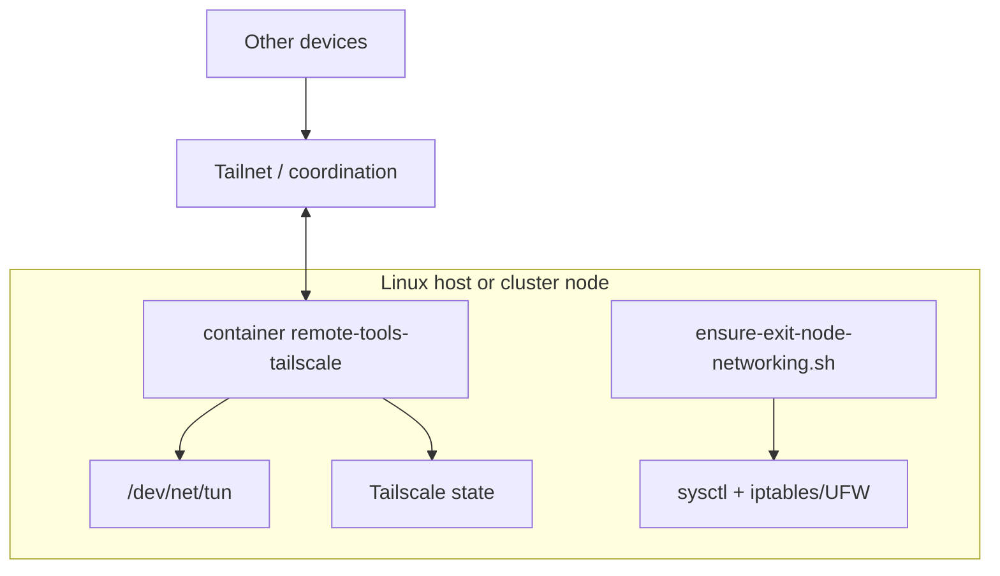
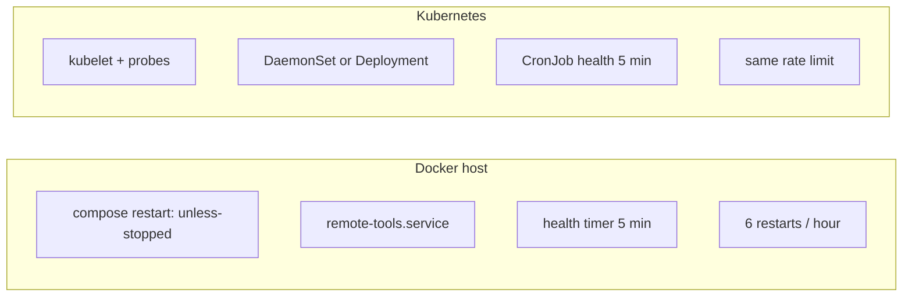
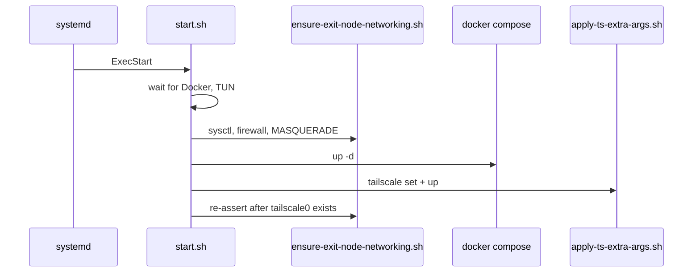

# Architecture

remote-tools runs Tailscale in a container with **host networking**, then layers systemd or Kubernetes around it so the node stays on the tailnet and usable as an exit node.

It is not the Tailscale Kubernetes Operator. It makes **the host or node** reachable (SSH to the machine, internet via the node WAN), not cluster Services.

## Components

| Piece | Docker / systemd | Kubernetes |
|-------|------------------|------------|
| Image | `ghcr.io/brianlechthaler/remote-tools:latest` | same |
| Network | `network_mode: host` | `hostNetwork: true` |
| Identity | Docker volume `remote-tools-tailscale-state` | hostPath `/var/lib/remote-tools/tailscale` |
| Auth | `/etc/remote-tools/env` | Secret `remote-tools-auth` |
| Flags | compose `TS_EXTRA_ARGS` | ConfigMap `remote-tools-config` |
| ExtraArgs re-apply | `apply-ts-extra-args.sh` via docker exec | `apply-ts-extra-args-local.sh` in the image |
| Host NAT / firewall | `ensure-exit-node-networking.sh` as root | initContainer + watchdog sidecar (privileged) |

## Redundancy

| Layer | Docker / systemd | Kubernetes |
|-------|------------------|------------|
| Runtime restart | `restart: unless-stopped` | kubelet restarts + probes |
| Supervisor | `remote-tools.service` (`Restart=on-failure`) | DaemonSet / Deployment |
| Watchdog | `remote-tools-health.timer` (5 min) | CronJob + networking sidecar |
| Rate limit | 6 restarts / hour | same (`k8s-healthcheck.sh`) |
| State | Docker volume | hostPath `/var/lib/remote-tools/tailscale` |
| Updates | git pull + `docker pull` every 6h | CronJob `rollout restart` + `imagePullPolicy: Always` |

## Why ExtraArgs are re-applied

The Tailscale image uses `TS_AUTH_ONCE=true`. After a node is already authenticated, containerboot runs `tailscale set` **without** `TS_EXTRA_ARGS`, so `--advertise-exit-node` would not stick across upgrades.

`start.sh` / `update.sh` / `healthcheck.sh` (and the Kubernetes health CronJob) call `tailscale set` then `tailscale up` with those flags. Exit-node mode is confirmed via `AdvertiseRoutes` containing `0.0.0.0/0` and `::/0`, not a fictional `AdvertiseExitNode` prefs field.

## Boot path (host)

## Related

- [Exit node](features/exit-node.md)
- [Health watchdog](features/health-watchdog.md)
- [Auto-update](features/auto-update.md)
- [Kubernetes](features/kubernetes.md)
- [Container image](features/container-image.md)
