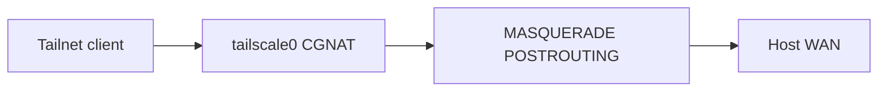

# Exit node

The stack advertises the host or node as a Tailscale **exit node** so other devices can send internet traffic through it.

## Overview

Defaults include `--advertise-exit-node` in `TS_EXTRA_ARGS`. Advertisement is not enough:

1. Flags must actually apply after login (`tailscale set` + `tailscale up`). See [Architecture](../architecture.md).
2. The host must forward and SNAT CGNAT traffic (sysctl, firewall, MASQUERADE).
3. An admin must approve the node: **Machines → … → Edit route settings → Use as exit node**.

Exit-node prefs are the advertised default routes `0.0.0.0/0` and `::/0` (`AdvertiseRoutes`). `ExitNodeOption=true` in `tailscale status --json` means the control plane has approved the offer.

## Host networking (`ensure-exit-node-networking.sh`)

Run as root by `install.sh`, `start.sh`, `update.sh`, and `healthcheck.sh` (and the Kubernetes init/watchdog containers).

| Step | What it does |
|------|----------------|
| sysctl | Writes `/etc/sysctl.d/99-remote-tools-tailscale.conf`: IPv4/IPv6 forwarding, `rp_filter=2` (loose), `src_valid_mark=1` |
| firewalld | Enables masquerade when firewalld is active |
| UFW | Allows `tailscale0` and `ufw route allow` between `tailscale0` and the WAN iface |
| iptables fallback | Idempotent `MASQUERADE` for `100.64.0.0/10` (and IPv6 `fd7a:115c:a1e0::/48`) plus `FORWARD ACCEPT` on `tailscale0` |

Loose `rp_filter` is required; strict mode drops forwarded exit-node packets (see [tailscale/tailscale#3310](https://github.com/tailscale/tailscale/issues/3310)).

Tailscale's own mark-based NAT is often defeated by Docker's iptables ownership or UFW default-deny FORWARD. DNS can still resolve on the client while `ping`/`curl` through the exit node time out. The CGNAT MASQUERADE fallback covers that case.



## Usage

After first connect, approve the machine in the admin console. Other devices then select this host as their exit node.

Do not set `NoSNAT` / `--snat-subnet-routes=false` with exit-node advertising. The apply script logs a warning; internet via this node can blackhole.

## Troubleshooting

| Symptom | What to check |
|---------|----------------|
| Node online, clients have no internet | Admin approval (`ExitNodeOption`). Then `sudo /opt/remote-tools/scripts/update.sh` or wait for the health timer |
| DNS works, ping/HTTPS timeout | Host logs for `MASQUERADE` / `rp_filter`. Confirm `ensure-exit-node-networking.sh` ran as root |
| `--advertise-exit-node` missing after upgrade | Health/start apply ExtraArgs. Confirm compose/ConfigMap still has the flag |
| `failed to look up local user` | You enabled Tailscale SSH. Use host sshd instead |

Offline checks (no auth key):

```bash
./scripts/test-exit-node.sh
```

## Related

- [Configuration](configuration.md)
- [Health watchdog](health-watchdog.md)
- [Kubernetes](kubernetes.md)
