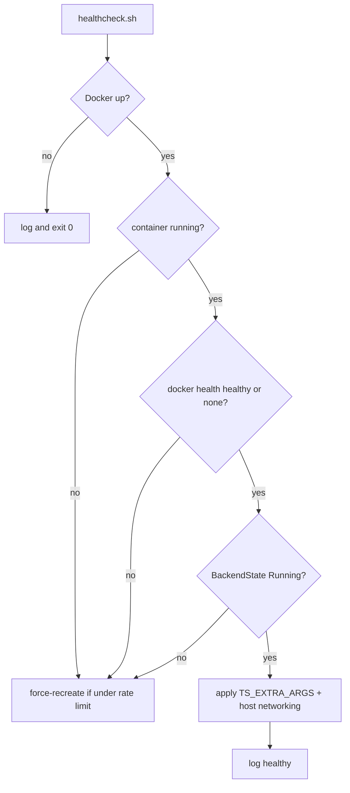

# Health watchdog

A 5-minute timer (or CronJob) checks that Tailscale is running and connected, re-applies ExtraArgs, and re-asserts host NAT. Restarts are capped at **6 per hour**.

## Overview

| | Docker / systemd | Kubernetes |
|--|------------------|------------|
| Schedule | `remote-tools-health.timer`: `OnBootSec=3min`, `OnUnitActiveSec=5min` | CronJob `remote-tools-health`: `*/5 * * * *` |
| Script | `scripts/healthcheck.sh` | `scripts/k8s-healthcheck.sh` (mounted from ConfigMap) |
| Rate-limit file | `/var/lib/remote-tools/health-restarts.log` | emptyDir stamp in the CronJob pod |
| Sidecar | n/a | `watchdog` container re-runs host networking every `WATCHDOG_INTERVAL_SECONDS` (default 300) |

If Docker is down, the host script logs and exits 0 so the timer does not flap.

## Host checks (`healthcheck.sh`)



Container health comes from compose: `tailscale status` must show a `100.` address. Start period is 90s.

## Kubernetes

The health CronJob execs into Tailscale pods, runs the in-image ExtraArgs helper, and deletes unhealthy pods when under `MAX_RESTARTS_PER_HOUR`. Workload probes still apply independently.

Manual run:

```bash
sudo /opt/remote-tools/scripts/healthcheck.sh
# or
kubectl -n remote-tools create job --from=cronjob/remote-tools-health health-manual
./scripts/k8s-healthcheck.sh
```

## Troubleshooting

| Log / symptom | Meaning |
|---------------|---------|
| `restart rate limit reached (6/hour)` | Watchdog will not recreate until the hour window drops |
| `container health check failing` | Compose healthcheck failed (no `100.` address yet, or tailscaled stuck) |
| `tailscale backend not running` | `BackendState` is not `Running` |
| `docker unavailable` | Host script skipped; fix Docker, do not expect a restart from this timer |

## Related

- [Architecture](../architecture.md)
- [Exit node](exit-node.md)
- [Auto-update](auto-update.md)
